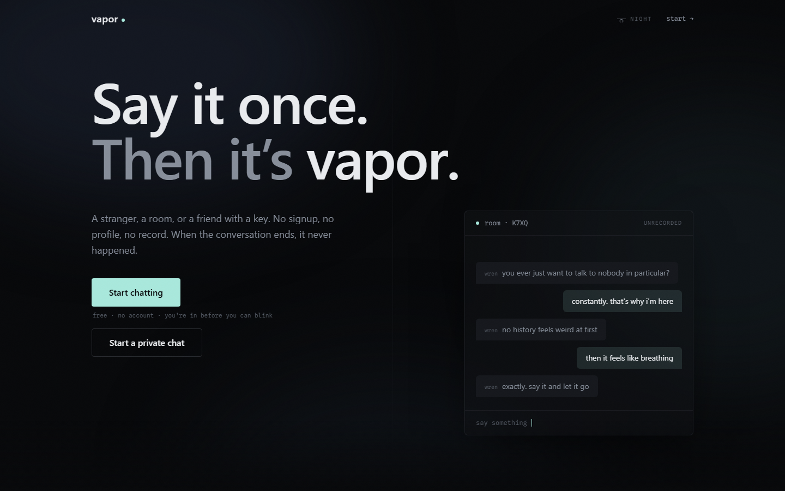
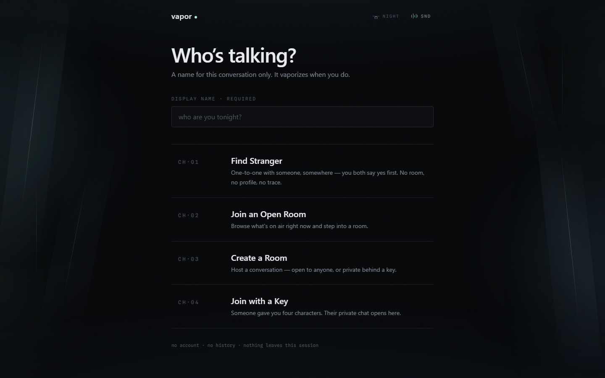
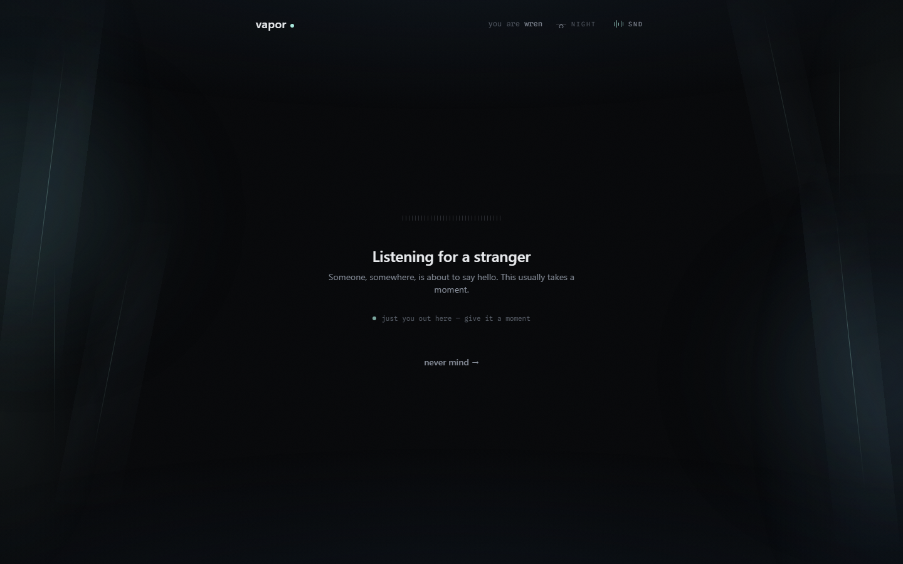
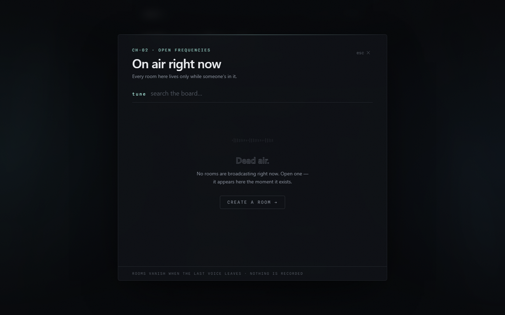
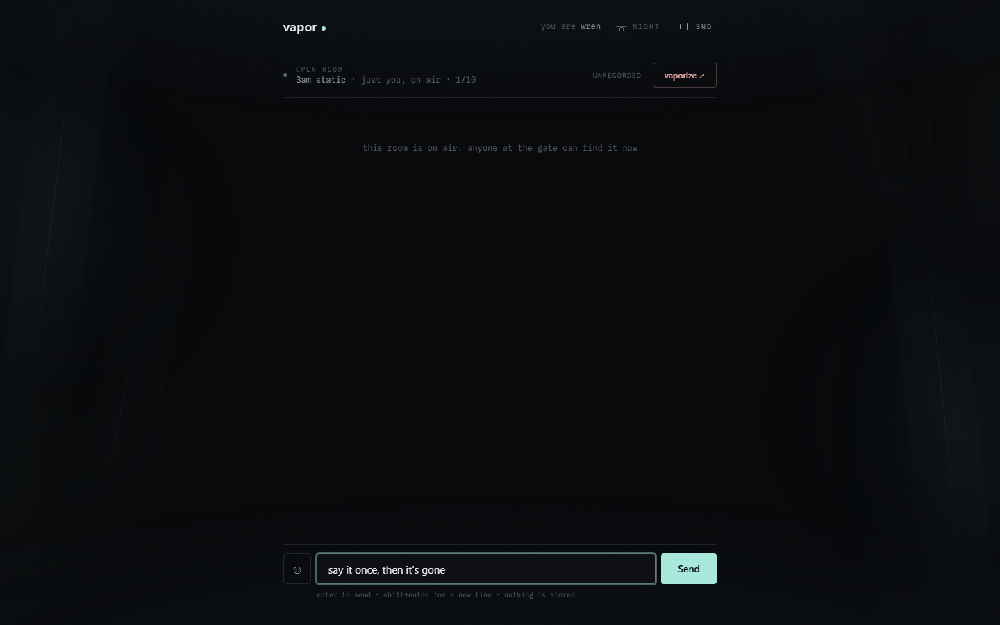
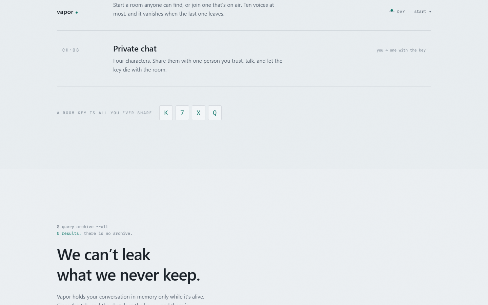
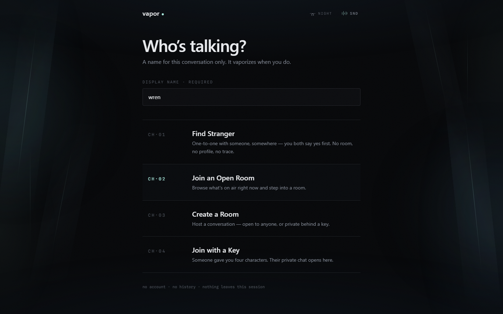

<div align="center">


# Vapor

### **Say it once. Then it's vapor.**

Anonymous real-time chat with **zero signup** and **zero history**.
Talk to a stranger, join an open room, or open a private one with a key.
When the conversation ends, it never happened.

<br />

[](https://www.vaporchat.dev)
[](public/vapor_app/vapor.apk)
[](#-why-vapor-exists)

<br />


<br />



</div>

<br />

---

## ✦ Why Vapor exists

Every chat app you use is a filing cabinet. Messages sit on a disk somewhere, indexed and
waiting. Vapor is built the opposite way — **there is no database at all**. Rooms, names,
presence and messages live only in RAM on a single Node process. When the last person leaves
a room, the garbage collector is the delete button.

> **No account. No profile. No log. No recovery.** If you didn't read it, it's gone.

<br />

## ✦ Features

| | |
|---|---|
| 🎲 **Find a stranger** | Anonymous 1v1 matchmaking with a mutual-consent handshake — the room only opens if you *both* say yes. Declined pairs won't be shown to each other again for 10 minutes. |
| 📡 **Open rooms** | A live directory of discoverable group rooms, up to 10 voices each. Join a conversation already in the air. |
| 🔑 **Private rooms** | Keyed 1v1 or group rooms — invisible to the directory, joinable only by a 4-character key or an invite link. |
| 💨 **Vaporize** | One exit button. In a 1v1 it ends the room for both sides; in a group it just takes you out. |
| ↩️ **Quoted replies** | Replies carry their own excerpt over the wire — the server stores nothing, so the quote *is* the context. |
| 🔗 **Deep links** | `/#/join/<token>` on web, `vapor://join/<token>` on Android, with App Links + `intent://` fallback for a one-tap jump from browser to app. |
| 🔁 **Seat resume** | Refresh or lose signal and you have 30 seconds to reclaim your exact seat — nobody else even sees you leave. |
| 🌌 **WebGL atmosphere** | A Three.js / Vanta fog field that reacts to where you are in the app, choreographed with GSAP. |
| 🌗 **Night & day** | Full light/dark theming resolved before first paint — no flash, no flicker. |

<br />

## ✦ Screens

<table>
<tr>
<td width="50%"><br /><sub><b>The gate</b> — pick a name, pick a door</sub></td>
<td width="50%"><br /><sub><b>Matching</b> — consent handshake with a stranger</sub></td>
</tr>
<tr>
<td><br /><sub><b>Browser</b> — live directory of open rooms</sub></td>
<td><br /><sub><b>Room</b> — typing signals, replies, presence</sub></td>
</tr>
<tr>
<td><br /><sub><b>Daylight</b> — the whole app, inverted</sub></td>
<td><br /><sub><b>Ended</b> — and that's the last of it</sub></td>
</tr>
</table>

<br />

## ✦ Architecture

```
        ┌──────────────────────┐        ┌──────────────────────┐
        │   Web SPA            │        │   Android (native)   │
        │   React 19 · Vite 8  │        │   Kotlin · Compose   │
        │   Three.js · GSAP    │        │   Material 3 · MVVM  │
        └──────────┬───────────┘        └──────────┬───────────┘
                   │                               │
                   └───────────────┬───────────────┘
                                   │
                    shared/protocol.ts — one typed contract
                        Socket.IO 4 over WSS
                                   │
                                   ▼
        ┌──────────────────────────────────────────────────────┐
        │           Node 22 · Express 5 · Helmet 8             │
        │  in-memory rooms · queue · presence · resume tokens  │
        │  token-bucket rate limiter · 4 KB frame cap          │
        │                  ── no database ──                   │
        └──────────────────────────────────────────────────────┘
```

`shared/protocol.ts` is the single source of truth. Every event name, payload, limit and
room rule is declared once and consumed by the server, the React client and (mirrored in
Kotlin) the Android app. The server is authoritative — it assigns ids, keys, timestamps and
presence, and echoes your own messages back to you so there is exactly one render path.

**Four room kinds, four rule sets:**

| Kind | Capacity | Discoverable | Keyed | Shareable | Ends when |
|---|:--:|:--:|:--:|:--:|---|
| `stranger` | 2 | — | — | — | either side leaves |
| `public` | 10 | ✓ | — | ✓ | last voice leaves |
| `private` | 2 | — | ✓ | ✓ | either side leaves |
| `private-group` | 10 | — | ✓ | ✓ | last voice leaves |

<br />

## ✦ Quick start

```bash
git clone https://github.com/YashDave11/VaporChat.git
cd VaporChat
npm install
cp .env.example .env      # defaults work fine for local dev
npm run dev
```

Web on **http://localhost:5173**, socket server on **:3001**. Both start together with hot
reload — open two browser windows and talk to yourself.

<details>
<summary><b>All scripts</b></summary>

<br />

| Script | What it does |
|---|---|
| `npm run dev` | Vite + tsx watch, concurrently |
| `npm run dev:web` | Frontend only |
| `npm run dev:server` | Socket server only |
| `npm run build` | Type-check then bundle to `dist/` |
| `npm start` | Run the production server |
| `npm run lint` | Oxlint |
| `npm run test:smoke` | End-to-end socket smoke test |

</details>

<details>
<summary><b>Environment variables</b></summary>

<br />

**Backend** (Render → Environment)

| Var | Example |
|---|---|
| `PORT` | `3001` |
| `NODE_ENV` | `production` |
| `CORS_ORIGIN` | `https://www.vaporchat.dev` (comma-separate for multiple) |

**Frontend** (Vercel → Environment Variables — must be `VITE_`-prefixed)

| Var | Example |
|---|---|
| `VITE_API_URL` | `https://api.vapor.chat` |
| `VITE_PUBLIC_APP_ORIGIN` | `https://www.vaporchat.dev` — canonical origin for invite links |

</details>

<details>
<summary><b>Building the Android app</b></summary>

<br />

`android/` is a **native Jetpack Compose port**, not a webview wrapper. It mirrors the web
architecture 1:1 — `ChatViewModel.kt` ports `useChatSession.ts`, `Protocol.kt` mirrors
`shared/protocol.ts`.

Requires **JDK 17–21** (not 24) and **compileSdk 34** with AGP 8.5.2.

```bash
export JAVA_HOME=/path/to/jdk-17   # any JDK 17–21
gradle -p android :app:assembleDebug
# → android/app/build/outputs/apk/debug/app-debug.apk
```

A prebuilt APK also ships at [`public/vapor_app/vapor.apk`](public/vapor_app/vapor.apk).

</details>

<br />

## ✦ Security & hardening

- **Helmet 8** — HSTS (2-year max-age), CSP directives, strict referrer policy
- **Token-bucket rate limiting** per IP — burst of 6, refill 1.2/s
- **Connection caps** — max 12 sockets per IP
- **4 KB frame ceiling** (`maxHttpBufferSize`) with strict server-side truncation
- **Zero untyped deserialization** — every payload is shaped by the shared protocol
- **Nothing to breach** — no database, no logs, no message retention

<br />

## ✦ Project layout

```
├── src/
│   ├── chat/          ChatApp, Room, Gate, Composer, useChatSession, socket
│   ├── components/    landing page, Vanta/WebGL backgrounds, theme toggle
│   ├── hooks/  lib/   useIsMobile, url + theme helpers
│   └── index.css      Tailwind v4 + HSL token engine
├── server/
│   ├── index.ts       Express + Socket.IO bootstrap, Helmet, rate limiter
│   ├── rooms.ts       in-memory room registry, queue, matchmaking
│   ├── handlers.ts    every client → server event
│   └── smoke.test.ts  end-to-end socket test
├── shared/protocol.ts the wire contract — limits, room rules, event types
├── android/           native Kotlin + Jetpack Compose client
└── scripts/           favicon generation, Playwright screenshot capture
```

<br />

## ✦ Deployment

Frontend ships to **Vercel** (static `dist/`), backend to **Render** via the included
[`render.yaml`](render.yaml) blueprint with a `/health` check. Full walkthrough in
[DEPLOYMENT.md](DEPLOYMENT.md).

<br />

## ✦ License

Not yet licensed — all rights reserved. Open an issue if you'd like to use it.

<br />

<div align="center">
<sub>Built by <a href="https://github.com/YashDave11">Yash Dave</a></sub>
<br /><br />
<b>Talk. Then it's gone.</b>
</div>
